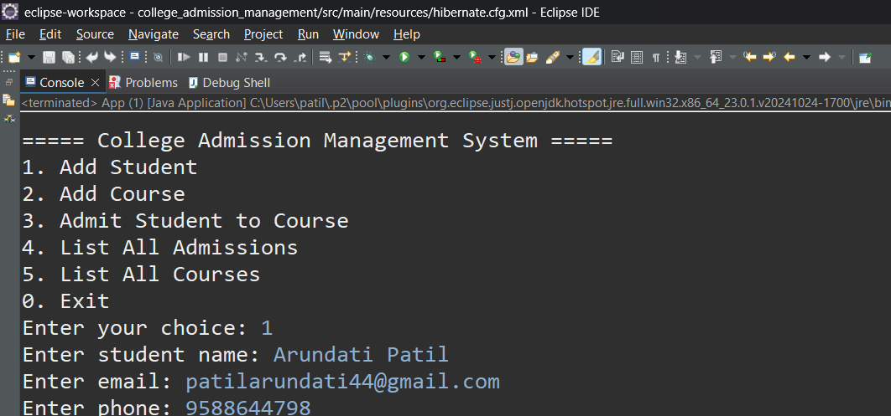

#  == Admission Management System == 

A **console-based Java application** using **Maven**, **JPA**, and **Hibernate 7.x** with **PostgreSQL** to manage college admissions. This system allows administrators to manage students, courses, and admissions through a **menu-driven interface**.

---

##  Features

- **Add Student** – Register a new student with name, email, and phone.
- **Add Course** – Add a course with duration and title.
- **Admit Student** – Assign a student to a course with date tracking.
- **List All Admissions** – Show all students and their respective courses.
- **List All Courses** – Display all available courses in the system.
- **Menu-Driven Interface** – Easy-to-use console interface.

---

##  Technologies Used

| Tool / Library      | Purpose                                 |
|---------------------|------------------------------------------|
| Java (JDK 17+)       | Application logic                        |
| Maven                | Dependency management                   |
| Hibernate 7.x (JPA)  | ORM for database interaction            |
| PostgreSQL           | Database management system              |

---

##  Maven Dependencies

Add the following to your `pom.xml`:

```xml
<dependencies>
    <dependency>
        <groupId>org.hibernate.orm</groupId>
        <artifactId>hibernate-core</artifactId>
        <version>7.0.1.Final</version>
    </dependency>

    <dependency>
        <groupId>jakarta.persistence</groupId>
        <artifactId>jakarta.persistence-api</artifactId>
        <version>3.1.0</version>
    </dependency>
```
---

## Prerequisites

• JDK 17 or above – Required to run the Java application.

• PostgreSQL 15 or higher – For storing student, course, and admission data.

• pgAdmin – GUI tool to interact with your PostgreSQL database.

• IDE – Use Eclipse, IntelliJ, or VS Code to write and run the project

---

##  Database Setup

```sql
-- Table: student
CREATE TABLE student (
    student_id SERIAL PRIMARY KEY,
    name VARCHAR(100) NOT NULL,
    email VARCHAR(100),
    phone VARCHAR(20)
);

--  Table: course
CREATE TABLE course (
    course_id SERIAL PRIMARY KEY,
    course_name VARCHAR(100) NOT NULL,
    duration INT
);

--  Table: admission
CREATE TABLE admission (
    admission_id SERIAL PRIMARY KEY,
    student_id INT REFERENCES student(student_id),
    course_id INT REFERENCES course(course_id),
    admission_date DATE DEFAULT CURRENT_DATE
);
```
---

## 📸 Project Screenshot

Below is a screenshot of the working **College Admission Management System**:



---

## Author

Name: Arundati Anand Patil

Email: patilarundhati44@gmail.com

GitHub: patilarundhati44


    <
